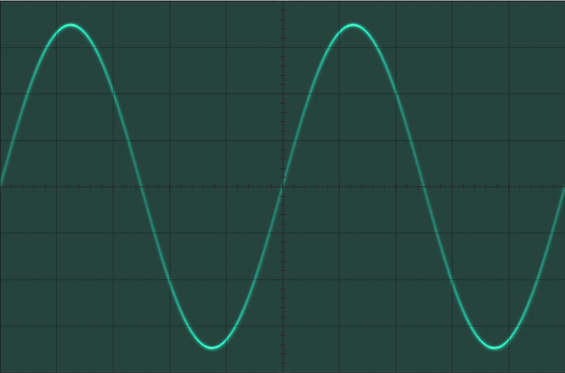
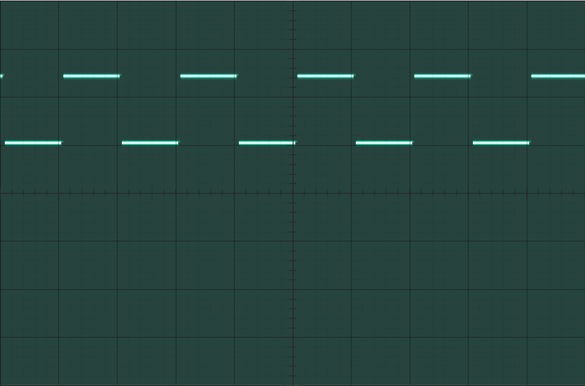
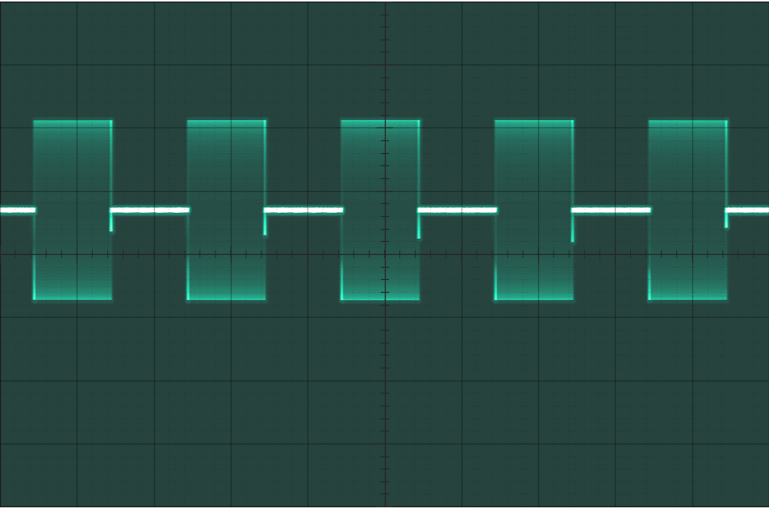

# plotscope
Matlab plot simulating an analog oscilloscope screen.

See [plotscope.demo](plotscope.demo) for usage.

## Examples

Sine wave

Square wave

On/off modulation

Amplitude modulation with step

## Authors

* **Reinoso Guzman** - [Electronicayciencia](http://electronicayciencia.blogspot.com/)

## License

This project is licensed under the GNU General Public License v3.0 - see the [LICENSE.md](LICENSE.md) file for details
