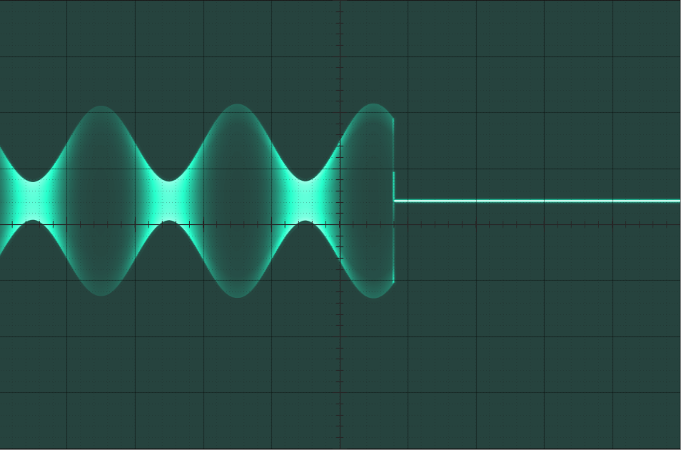

# plotscope
Matlab plot simulating an analog oscilloscope screen.

See [plotscope demo](plotscope_demo.m) for usage.

## Examples

Sine wave

Square wave

On/off modulation

Amplitude modulation with step

## Authors

* **Reinoso Guzman** - [Electronicayciencia](http://electronicayciencia.blogspot.com/)

## License

This is free and unencumbered software released into the public domain - see the [LICENSE](LICENSE) file for details
